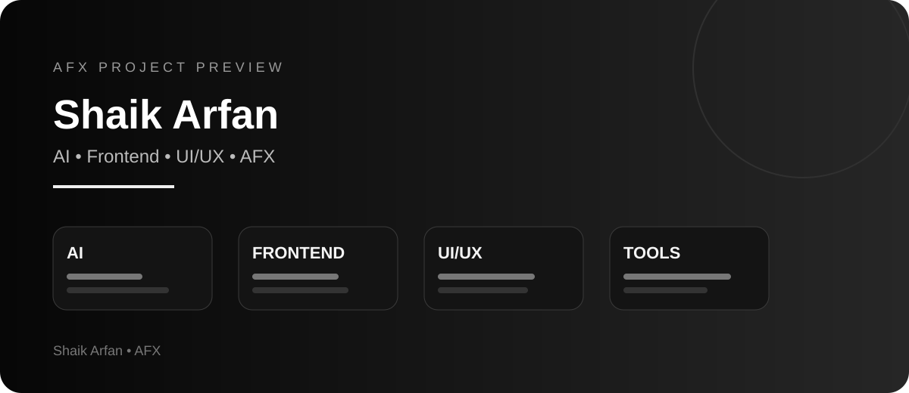
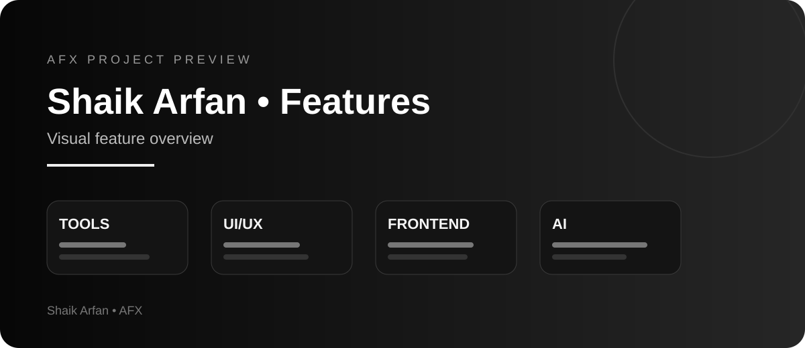

<p align="center">
  
</p>

<p align="center">
  
</p>

<div align="center">

# ⚡ SHAIK ARFAN


<br/>


</div>

---

## 👨‍💻 About Me

```js
const arfan = {
  name: "Shaik Arfan",
  brand: "AFX",
  roles: [
    "AI Developer",
    "Frontend Developer",
    "UI/UX Designer"
  ],
  interests: [
    "Artificial Intelligence",
    "Developer Tools",
    "LLMs & RAG",
    "Automation",
    "Web Development",
    "Cybersecurity"
  ],
  currentMission: "Build useful products that solve real-world problems.",
  motto: "CODE. BUILD. EVOLVE."
};
```

I enjoy building **AI-powered products, developer utilities, frontend experiences, and productivity tools**.

> **I don't just learn technology — I build with it.**

---

## ⚡ Tech Stack

<div align="center">


</div>

### AI & Development


---

## 🚀 Featured AFX Projects

| Project | What it does | Tech |
|---|---|---|
| [**AFX Regex Tester**](https://github.com/arfanshaik/AFX-Regex-Tester) | Live regex playground with matches, groups, replacements, presets and history | JavaScript |
| [**AFX API Inspector**](https://github.com/arfanshaik/AFX-API-Inspector) | Developer-focused API inspection and testing utility | TypeScript |
| [**AFX LogWatch**](https://github.com/arfanshaik/AFX-LogWatch) | Lightweight log monitoring utility | Go |
| [**AFX PC Optimizer**](https://github.com/arfanshaik/AFX-PC-Optimizer) | PC optimization and system utility project | System Tools |
| [**AFX Driver Checker**](https://github.com/arfanshaik/AFX-Driver-Checker) | Driver-checking utility for Windows systems | System Tools |
| [**AFX Gaming Mode**](https://github.com/arfanshaik/AFX-Gaming-Mode) | Gaming-focused PC performance utility | System Tools |

---

## 📊 GitHub Analytics

<div align="center">


</div>

<div align="center">


</div>

---

## 🏆 GitHub Trophies

<div align="center">


</div>

---

## 📈 Contribution Activity

<div align="center">


</div>

---

## 🎯 Currently Building

```text
⚡ AFX Developer Tools
🤖 AI-powered web applications
🧠 LLM + RAG experiments
🎨 Modern UI/UX experiences
🛠️ Productivity and system utilities
```

---

## 🧠 Developer Philosophy

<div align="center">

### `ARFAN — ENCRYPTION IS NOT A CRIME`

**Build. Break. Learn. Rebuild.**

**CODE. BUILD. EVOLVE.**

</div>

---

<div align="center">

### ⚡ AFX

**AI × DEVELOPMENT × DESIGN**

<br/>


</div>
